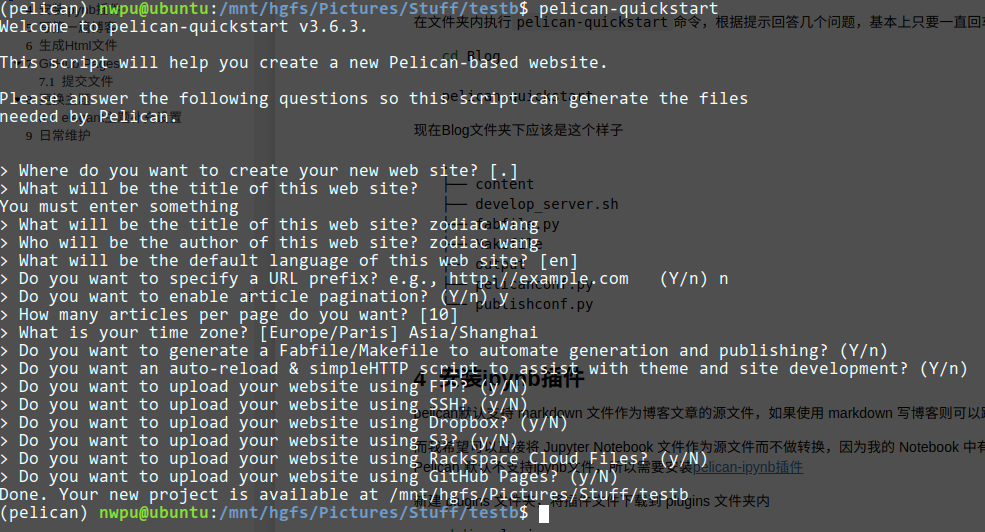

Title: pelican github pages
Date: 2025-1-05 21:01
Category: pelican

跑通了，言简意赅的记录一下过程。

# 首先，安装pelican;
python -m pip install "pelican[markdown]"

# 创建一个github仓库
 xxx.github.io;

克隆到本地；

# pelican-quickstart

会有一些问题，作为初始化选项,
which begins by asking some questions about your site:



其中，时区这一项填 Asia/Shanghai

# GitHub 上设置免密码登录

这一步是必需的，因为当前github已经不再支持密码push仓库更新；

*remote: Support for password authentication was removed on August 13, 2021.
remote: Please see https://docs.github.com/get-started/getting-started-with-git/about-remote-repositories#cloning-with-https-urls for information on currently recommended modes of authentication.
fatal: Authentication failed for 'https://github.com/luzhongzhou/luzhongzhou.github.io.git/'*


为了在 GitHub 上设置免密码登录，你可以使用 SSH 密钥对来代替 HTTPS 协议进行身份验证。以下是设置过程的步骤：

### 生成一个新的 SSH 密钥（如果还没有的话）

如果你还没有一个 SSH 密钥，可以通过下面的命令生成一个新的密钥。你需要指定一个邮箱地址，这通常是你在 GitHub 上注册的邮箱。

```bash
ssh-keygen -t ed25519 -C "your_email@example.com"
```

如果你的 SSH 客户端不支持 Ed25519 算法，你可以使用 RSA 算法：

```bash
ssh-keygen -t rsa -b 4096 -C "your_email@example.com"
```

系统会提示你输入文件保存位置和密码（passphrase）。如果你不想每次使用 SSH 密钥时都输入密码，可以留空直接按 Enter 键。

### 添加 SSH 密钥到 ssh-agent

启动 `ssh-agent` 并添加你的 SSH 私钥：

```bash
# 启动 ssh-agent 在背景运行
eval "$(ssh-agent -s)"

# 添加 SSH 私钥到 ssh-agent
ssh-add ~/.ssh/id_ed25519  # 如果使用的是 Ed25519 算法
# 或者
ssh-add ~/.ssh/id_rsa      # 如果使用的是 RSA 算法
```

### 将 SSH 公钥添加到 GitHub 账户

1. 复制你的 SSH 公钥内容。如果使用的是默认文件名，可以执行以下命令：
   ```bash
   cat ~/.ssh/id_ed25519.pub  # 对于 Ed25519 算法
   # 或者
   cat ~/.ssh/id_rsa.pub      # 对于 RSA 算法
   ```

2. 登录到 GitHub，并进入账户设置中的 "SSH and GPG keys" 页面。
3. 点击 "New SSH key" 按钮。
4. 给你的新 SSH 密钥提供一个标题（例如你的计算机名称），然后将之前复制的公钥粘贴到 "Key" 字段中。
5. 点击 "Add SSH key" 按钮完成添加。

### 测试 SSH 连接

最后，测试一下是否能成功连接 GitHub：

```bash
ssh -T git@github.com
```

你应该会看到一条欢迎信息，表明你已经成功设置了免密码登录。

### 更新本地仓库的远程 URL（如果需要）

如果你已经在使用 HTTPS 方式克隆了仓库，那么你需要更新远程 URL 为 SSH 格式。可以使用如下命令更改：

```bash
git remote set-url origin git@github.com:username/repository.git
```

请确保替换 `username` 和 `repository` 为实际的用户名和仓库名。

完成以上步骤后，你应该能够通过 SSH 免密码访问 GitHub 了。

# pelican contents

该命令用于生成生成静态页面，在output目录下；

# git push

推送到github仓库；

# 设置GitHub Pages

为了将 Pelican 生成的静态网站部署到 GitHub Pages，你需要完成以下几个步骤。这里假设你已经有一个 Pelican 项目，并且它已经被推送到 GitHub 仓库中。

### 1. 准备 Pelican 站点

确保你的 Pelican 项目可以正常生成静态文件。通常，你会在项目的根目录下运行 `pelican content` 来生成站点。这会在 `output` 文件夹（或你在配置中指定的输出目录）中创建所有静态文件。

### 2. 配置 GitHub Pages

前往你的 GitHub 仓库页面，点击左侧菜单中的 "Settings"，然后滚动到 "Pages" 部分（或者直接从侧边栏选择 "Pages"）。在这里你可以设置 GitHub Pages 的源：

- **Source**：选择分支和文件夹作为 GitHub Pages 的来源。对于 Pelican 项目，通常会使用默认分支（例如 `main` 或 `master`），并将 `/docs` 或 `/root` 作为路径。如果你希望使用一个专门的 `gh-pages` 分支，也可以选择这个选项。
  
  - 如果你选择 `/root`，那么所有的静态文件应该放在仓库的根目录下。
  - 如果你选择 `/docs`，则需要把所有静态文件放入名为 `docs` 的子目录中。

- **Custom domain (可选)**：如果你有自定义域名，可以在这一栏输入你的域名。

这里我选用docs文件夹的方式，将output目录下的内容拷贝到docs文件夹下，并提交到github仓库中。

### 3. 自动化部署流程

为了让 GitHub Pages 在每次代码更新时自动更新站点内容，你可以设置一个 CI/CD 流程。最简单的方法是使用 GitHub Actions。以下是一个简单的 GitHub Action 工作流示例，用于构建并部署 Pelican 网站到 GitHub Pages：

#### 创建 `.github/workflows/deploy.yml`

在你的仓库根目录下创建一个 `.github/workflows` 目录（如果不存在的话），并在其中添加一个新的 YAML 文件 `deploy.yml`，内容如下：

```yaml
name: Deploy to GitHub Pages

on:
  push:
    branches:
      - main  # 这里填写触发动作的分支名称

jobs:
  build-and-deploy:
    runs-on: ubuntu-latest

    steps:
    - name: Checkout repository
      uses: actions/checkout@v3

    - name: Set up Python
      uses: actions/setup-python@v4
      with:
        python-version: '3.x'

    - name: Install dependencies
      run: |
        pip install --upgrade pip
        pip install pelican markdown

    - name: Build the site
      run: |
        cd path/to/pelican/project  # 如果不是在根目录，请更改此路径
        pelican content -o output -s pelicanconf.py

    - name: Deploy to GitHub Pages
      uses: peaceiris/actions-gh-pages@v3
      with:
        github_token: ${{ secrets.GITHUB_TOKEN }}
        publish_dir: ./path/to/output  # 替换为你的输出目录
```

请根据你的实际情况调整上述脚本中的路径和其他参数。这段代码会监听 `main` 分支上的推送事件，并在检测到新提交时执行一系列命令来安装依赖、构建站点并部署到 GitHub Pages。

### 4. 提交并推送更改

最后，将这些更改提交并推送到 GitHub 仓库：

```bash
git add .
git commit -m "Setup GitHub Actions for Pelican deployment"
git push origin main
```

这样，当你的 Pelican 内容有任何更新并且被推送到仓库时，GitHub Actions 将自动为你构建并部署最新的静态站点到 GitHub Pages。

### 注意事项

- 确保你的 Pelican 项目配置正确，特别是 `pelicanconf.py` 中的设置。
- 如果你正在使用 Jekyll 不支持的插件或特性，记得禁用它们，因为 GitHub Pages 默认使用 Jekyll 构建站点。
- 检查 GitHub Pages 的构建日志以获取任何可能的问题信息。如果你选择了 `/root` 或 `/docs` 路径作为发布源，可以直接在 GitHub 上查看构建状态；如果你使用的是 `gh-pages` 分支，则需要通过 GitHub Actions 日志来监控构建过程。


# 参考文档：

[1] quickstart
https://docs.getpelican.com/en/latest/quickstart.html 

[2] 全球城市ZoneId
https://cloud.tencent.com/developer/article/1778546